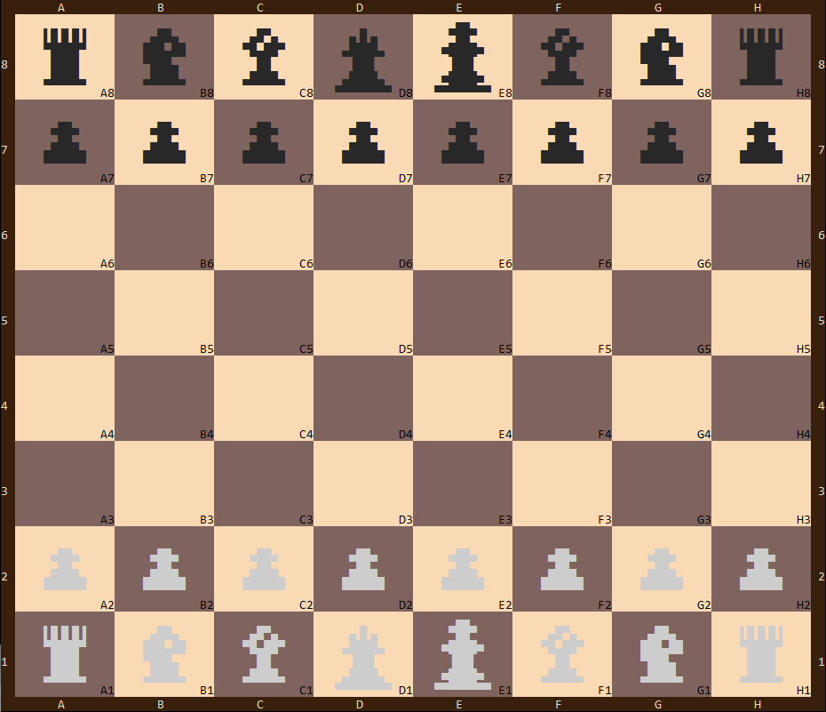

# Command Line Chess
### A project by Mayer, Moshe and Yoel

This is a chess program created to run entirely on the command line. It has local multiplayer as well as an [online](https://github.com/mo523/Chess_Server) one. We also created a single player vs. an 'ai' with varying levels of difficulty. 

We had a lot of fun making this and if your curious how we did it check out our [slideshow](https://mo523.github.io/Chess/).
The game uses [ANSI](https://en.wikipedia.org/wiki/ANSI_escape_code) escape codes to colorize the board. This works well in most terminals except windows (though there are workarounds, see below).

#### Windows Troubleshooting
Pre Windows 10 the only option is to use a third-party terminal or console emulator because java + cmd do not support the escape codes. You can also use [jansi](https://github.com/fusesource/jansi) to wrap the output in a supported way, but only [8 colors](https://en.wikipedia.org/wiki/ANSI_escape_code#Colors) are available.
Current versions of Windows 10 have native support for 256 bit color by enabling the [VirtualTerminalLevel](https://blogs.msdn.microsoft.com/commandline/2017/06/20/understanding-windows-console-host-settings/) key in the registry or by using the [Terminal](https://github.com/microsoft/terminal) app which has it enabled by default.
